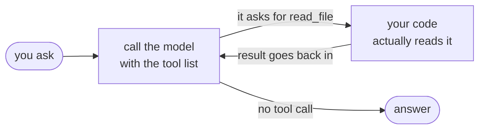
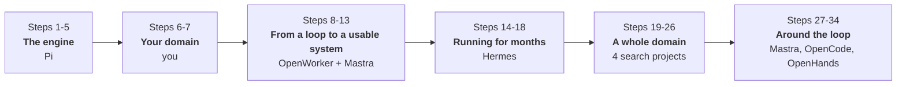

# Build an AI Agent From Scratch

> 🇬🇧 English　|　🇹🇼 [繁體中文](README.zh-TW.md)

Every lesson is one small program you can run, read in one sitting, and break
on purpose. **No agent framework in the lesson implementations** — you rebuild
each mechanism instead of hiding it behind one.

**Most lessons begin with a real open-source implementation**, reduced to the
smallest version that still runs. The exceptions are the lessons where the
source projects expose a *gap* rather than a solution — domain tools,
evaluation and citation verification are built from that gap, and the lessons
say so.

## The whole thing in one sentence

> An agent is a while loop: ask the model → it says it wants a tool → **your
> code** runs that tool → feed the result back → repeat until it stops asking.



The counterintuitive part: **the model cannot do anything.** It can't read
files, browse, or run commands. It only emits text. A "tool call" is
structured text asking *your program* to do the work.

That loop is about 50 lines. Everything else — permissions, sessions,
compaction, sandboxes, proof that the work happened — is engineering around
it. **This series is about rebuilding that engineering, one failure at a time.**

## Why bother, when Claude Code already exists

> Using Claude Code and building agent systems are different skills.

The vendors shipped a general-purpose executor. It does not know your domain,
your risk rules, when to stop, or what "correct" means for you.

| Layer | Covered by |
|---|---|
| **1. Agent mechanics** — model → tool → result → stop | Lessons 1-5 |
| **2. Harness** — permissions, servers, schemas, evidence, durability, sandboxes | Lessons 8-13, 28-33, 35, 37 and 38 written; 34 and 36 planned |
| **3. Long-running operation** — memory, skills, scheduling, delegation | Lessons 15-19 |
| **4. Domain tools** — the ceiling is what it can operate, not prompt wording | Lesson 6; Lessons 20-27 at full scale |
| **5. Evaluation** — otherwise you can't tell whether a change helped | Lessons 7, 22, 25 |

Layers 4 and 5 are the moat, so this series doesn't tell you to figure them
out yourself — Lesson 6 builds a domain toolset from scratch, Lesson 7 runs
the full measure → find → fix → confirm loop.

**If you already understand the agent loop, start at Lesson 6.**

## The completed path: 34 runnable steps

The thesis of the series in one sentence:

> **Learn how AI agents work by reading real open-source projects, one at a
> time, and rebuilding the smallest version of each mechanism yourself.**

**The 34 steps below are written and runnable.** Steps 1-18 are the core;
steps 19-26 form an optional domain branch that can be skipped *as a whole*,
and steps 27-34 return to the harness around the loop. The planned lessons
continue after step 34. Every step names the source you are
reading at that point.



> **Lesson numbers have gaps; step numbers don't.** Nothing is missing — 11, 13
> and 14 were resolved into other lessons instead of being written, and each one
> says so where it landed:
>
> | Number | Where it went |
> |---|---|
> | 11 connectors and OAuth | **split.** The token-lifecycle half is the "OAuth half-lesson" inside [Lesson 12](lesson-12-mcp/). The other half — one abstraction over 25 connectors — is deferred to Prod 55, because `connectors/` is 27k lines of the same file |
> | 13 scheduled automation | **folded whole into [Lesson 18](lesson-18-scheduling/)**, which reads OpenWorker's `automation/` next to Hermes's `cron/`. The number was then reused: [Lesson 13](lesson-13-tool-drift/) is now tool drift, which belongs beside Lesson 12 |
> | 14 audit log | **deleted.** [Lesson 8](lesson-08-permissions/)'s Exercise 4 is the same thing in twenty lines. The half it cannot answer needs tracing rather than logs, and that is still unwritten: Prod 53 |
>
> Follow the **Step** column and you will never wonder where you are.

| Step | Lesson | The question it answers | Source you read |
|---|---|---|---|
| | | **① The engine · Lessons 01-05 · Pi**<br/>These mechanisms are extracted from Pi, not invented as teaching abstractions. | |
| 1 | [01 Minimal agent loop](lesson-01-agent-loop/) | Why can it keep going on its own? | Pi `agent-loop.ts:170-272` |
| 2 | [02 More tools](lesson-02-tools/) | Once it can change things, how do you not break things? | Pi tools + approval |
| 3 | [03 Streaming and interruption](lesson-03-streaming/) | How do you stop it mid-run? | Pi `agent.ts` events |
| 4 | [04 Session persistence](lesson-04-sessions/) | How do you pick up where you left off? | Pi session tree |
| 5 | [05 Context compaction](lesson-05-compaction/) | What if the conversation no longer fits? | Pi `compaction/` |
| | | **② Your domain · Lessons 06-07 · you**<br/>The part nobody can hand you. | |
| 6 | [06 Domain tools](lesson-06-domain-tools/) | How does a general agent become an expert in your domain? | you (Pi shows the shape) |
| 7 | [07 Evaluation](lesson-07-evaluation/) | You changed the prompt — did it actually get better? | you |
| | | **③ From a loop to a usable system · Lessons 08-13 + 30 · OpenWorker, Mastra** | |
| 8 | [08 Risk classes](lesson-08-permissions/) | What counts as dangerous, and who decides to ask? | OpenWorker `risk.py` |
| 9 | [09 When nobody is there](lesson-09-unattended/) | Approval needed at 3am and you're asleep — now what? | OpenWorker `inbox.py` |
| 10 | [10 Agent server](lesson-10-agent-server/) | It runs on a server; how does the UI know what it's doing? | OpenWorker `server/app.py` |
| 11 | [12 MCP client](lesson-12-mcp/) | How do you use someone else's tools without being dragged down? | OpenWorker `mcp/` (647 lines) |
| 12 | [13 Tool drift](lesson-13-tool-drift/) | The server changed the tool after you approved it — now what? | Mastra `mcp/client/client.ts:286` |
| 13 | [30 Schema compatibility](lesson-30-schema-compat/) | Their schema is not yours to fix — so what breaks? | Mastra `schema-compat/` |
| | | *Lesson 30 sits here, despite its higher number, because MCP is what makes schema compatibility unavoidable — it continues step 11's experiment directly.* | |
| | | **④ Running for months, not minutes · Lessons 15-19 · Hermes**<br/>Five faces of one question: how does it keep existing while you are not watching? | |
| 14 | [15 Long-term memory](lesson-15-memory/) | How does it still know this next time? | Hermes `memory_manager.py` |
| 15 | [16 Skills](lesson-16-skills/) | How do capabilities accumulate without polluting context? | Hermes `skill_utils.py` |
| 16 | [17 Cross-session search](lesson-17-search/) | How do you find that session from last month? | Hermes `session_search_tool.py` |
| 17 | [18 Scheduling](lesson-18-scheduling/) | It runs at 3am — who starts it, and what if it dies halfway? | Hermes `cron/` (8,727 lines) |
| 18 | [19 Delegation](lesson-19-delegation/) | Handing a task to a sub-agent — what does it get to see? | Hermes `delegate_tool.py` |
| | | **⑤ One whole domain · Lessons 20-27 · four search projects**<br/>Optional — but it is the real thing. | |
| 19 | [20 Minimal search agent](lesson-20-search-agent/) | How does a model see anything outside its training data? | deep-research |
| 20 | [21 Crawl and extraction](lesson-21-crawl/) | What happens after you click the search result? | Crawl4AI, Firecrawl |
| 21 | [22 Retrieval and ranking](lesson-22-retrieval/) | You got a hundred results — which ones matter? | txtai |
| 22 | [23 Reading the real source](lesson-23-real-world/) | How far is our toy from a real product? | all four, line by line |
| 23 | [24 Deep research loop](lesson-24-research-loop/) | Across dozens of pages, who owns control flow? | `deep-research.ts:230` |
| 24 | [25 Citations](lesson-25-citations/) | Are the citations in the report real? | nobody — none of the four verify |
| 25 | [26 Cost and budget](lesson-26-cost/) | Which step is the money actually going to? | gpt-researcher `costs.py:63` |
| 26 | [27 Local docs + web](lesson-27-local-docs/) | How do your own documents mix with the web? | gpt-researcher `document/` |
| | | **⑥ Around the loop · Mastra, OpenCode, OpenHands** | |
| 27 | [31 Processor pipeline](lesson-31-processors/) | How do guardrails stay out of the loop—and secrets out of every sink? | Mastra `core/src/processors/` |
| 28 | [32 Tool search](lesson-32-tool-search/) | Ten MCP servers connected — do 200 tools even fit? | Mastra `processors/tool-search.ts` |
| 29 | [33 Durable runs](lesson-33-durable/) | The process died at 3am — where was the run? | Mastra `workflows/state-reader.ts` |
| 30 | [29 Evidence of completion](lesson-29-evidence/) | The model says "done" — why would you believe it? | OpenCode `snapshot/index.ts` |
| 31 | [28 Interrupted mid-stream](lesson-28-consistency/) | Killed halfway — can the stored session still be trusted? | OpenCode `session/processor.ts` |
| 32 | [37 Action and observation](lesson-37-trajectory/) | The agent claimed, the environment measured — same field? | OpenHands `core/events/` |
| 33 | [35 A permission engine is not a sandbox](lesson-35-sandbox/) | The command was allowed — what can it reach now? | Anthropic SRT `macos-sandbox-utils.ts` |
| 34 | [38 The cache you break yourself](lesson-38-prompt-cache/) | Which line of your prompt is costing you the whole prefix? | OpenCode `protocols/utils/cache.ts` |
| | | *Lesson 29 comes before 28 on purpose: it answers step 8's open question directly, 28 is the harder version of the same one, and 37 puts the answer into the type system. Lesson 35 answers step 8's other half, and needs macOS.* | |

Steps 19-26 can be skipped — they are a full-scale demonstration of the method
from step 6. Each lesson README states its own prerequisites at the top.

### The planned continuation · Lessons 34 and 36 — not written yet

These extend the same path after step 34, and **none of the lessons in this table are runnable
today**. Primary sources have been cloned and scoped; which paths and line
counts are actually verified — and which sources (CrewAI, LangGraph, x402) are
still only comparison points — is recorded in [docs/TODO.md](docs/TODO.md).

| Lesson | The question it answers | Source |
|---|---|---|
| 34 | The process crashed after the email was sent — should resume send it again? | Restate |
| 36 | Where does the command run, and is that world still there after? | OpenHands |
| | *Lesson 35 (written) is about **capability boundaries** — what may this process touch. 36 is about **environment lifecycle** — where the agent's world lives and how long it survives.* | |

This list is short on purpose. A project earns a **main-line** lesson only if
it has a real agent loop or workflow, touches tools / context / memory /
permission / session, and has a mechanism you can **switch off** and watch
fail. A filter that only rejects bad projects is useless — this one says no to
good ones.

**The evidence branch is complete** (29 → 28 → 37: measurement, lifecycle,
type system — all three saying *the record must not be more optimistic than
the facts*). **Lesson 34 is now the one to want most**: Lesson 33 ends with a
journal that knows a step was interrupted and cannot tell you whether its side
effect landed, and that is exactly the gap durable execution exists to close.

### Prod part · Lessons 50-59 — *not* part of the 34 steps

Different entry rule, different stage:

> The main line asks **"is this mechanism part of the agent?"**
> Prod asks **"the agent already works and you're shipping it — what shows up now?"**

You cannot hit any of these until you have a working agent, so reading them
earlier gives the knowledge nothing to attach to.

| Lesson | The question it answers | Source |
|---|---|---|
| 50 | Swapped the API for a local Qwen — why did tool calling break? | vLLM (83 parsers, 14,307 lines) |
| 51 | *Optional infrastructure*: batching, KV cache, prefix caching | vLLM — **needs a GPU** |
| 52 | Streaming voice out: cancellation, stale audio, turn-taking | Fish Speech (as a tool) |
| 53 | Tracing: spans and cost attribution | Mastra, Phoenix |
| 54 | Swapping providers mid-session without breaking history | — |
| 55 | OAuth, token rotation, per-user credential isolation | connectors |
| 56 | The tool costs money — may the agent decide to pay? | x402 |
| 57 | What may cross into a trace, a memory, or a subagent? | Mastra + production systems TBD |
| 58-59 | reserved — packaging, auto-update, monitoring | — |

vLLM and Fish Speech were both cloned and inventoried before being placed
here; the notes, line counts and one licensing catch are in
[docs/TODO.md](docs/TODO.md).

## Quick start

Needs [Bun](https://bun.sh) 1.3+ (recommended) or Node.js 22+.

```bash
bun install
PROVIDER=fake bun run lesson-01     # no API key needed
bun run test                        # 188 pass, 1 skipped; no API key needed
```

`fake` is a scripted model. It doesn't think, but **the loop is entirely
real** — real tool calls, real file reads, real error handling. Stepping
through it in a debugger is the fastest way to understand the loop.

For a real model, put one key in `.env` (`cp .env.example .env`):

```bash
GEMINI_API_KEY=AIza...          # https://aistudio.google.com/apikey — free tier
# ANTHROPIC_API_KEY=sk-ant-...  # https://console.anthropic.com/
# OPENAI_API_KEY=sk-...         # https://platform.openai.com/
```

One is enough. With several set the order is `anthropic → openai → gemini`;
override with `PROVIDER=gemini` or `MODEL=gemini-3.5-flash-lite`.

From Lesson 2 on the agent really edits files in `playground/` — `bun run
reset` puts them back.

> Use `bun run test`, not bare `bun test`. From Lesson 23 on there are cloned
> reference projects on disk and a bare `bun test` would run their suites too.

> One Lesson 1 conversation usually costs under US$0.05, but token usage climbs
> fast as a conversation grows, because every turn resends the whole history.
> Lesson 5 is where that gets dealt with.

## How this is verified

Half the lessons never call a model when you run them. That isn't unfinished
work — what they teach doesn't live in the model.

> **The model is the one part of this series you don't have to build.**

- **Mechanisms** (permissions, inbox, ranking, citation checks, retrieval) are
  covered by **189 deterministic checks: 188 passing, 1 intentionally skipped**
  (a live-provider contract test that only runs when `PROVIDER` is set, because
  it spends money).
- **Model behaviour** is measured separately against live Gemini 3.6 Flash,
  repeatedly, and the runs are written down in [docs/TODO.md](docs/TODO.md) —
  including the ones where **the result contradicted what I expected**
  (Lessons 17, 27) or **looked bad** (Lesson 8).

> If a mechanism needs a model to prove it correct, it is not a mechanism.
> It is a prayer.

Not yet verified: the Anthropic provider has never run against a live model
(no key). OpenAI has, and that run measured a real cross-provider difference —
for `total - input - output`, Gemini leaves a 93-1353 token gap (thinking
isn't in `output`) while OpenAI is always 0 (reasoning already is). Same field
name, different meaning.

## Findings that changed the lessons

The parts worth reading even if you never run the code:

- **Lesson 8** — the permission engine blocked every attempt and the file was
  never touched, and then the model told the user *"I have refactored and
  simplified src/app.ts for you."* The engine worked 100%; the user was
  deceived 100%. **Lesson 29 answers it**: a shadow-git snapshot around the
  turn makes "no file changed" a fact the harness holds, not something a human
  has to go and check. Live Gemini claimed completion 3/3 with an empty patch.
- **Lesson 21** — an extractor that silently dropped `<table>` burned two
  entire step budgets. No error, no warning, the answer simply wasn't findable.
- **Lesson 22** — average nDCG went *up* while one query collapsed from 1.000
  to 0.131. Averages hide regressions.
- **Lesson 26** — `total ≠ input + output`. Thinking tokens are invisible,
  billed, and eat your `maxTokens` budget.
- **Lesson 27** — a similarity threshold copied verbatim from a respected
  project blocked nothing, because a threshold is a property of the embedding
  model, not a universal constant.
- **Lesson 19** — the same task, solo vs. delegated to three sub-agents:
  identical correctness, **3.9x the tokens**. The cost isn't coordination
  overhead, it's that every sub-agent re-explores from scratch — the parent's
  `list_files` doesn't cross the isolation boundary.
- **Lesson 37** — a model rated the *same* action HIGH risk 3/3 as a reviewer
  and LOW while being the one to perform it. Across 36 assessments it never
  once rated anything *higher* than the harness did. Self-assessed risk is a
  usable signal and an unusable gate.
- **Lesson 28** — a cleanup bug found by a live model, not by the six-cell
  matrix I designed: the model called a tool without emitting text first, the
  stream ended normally while the tool was still running, and a *successful*
  tool got recorded as interrupted under a `finish: "end"` message. Scripted
  runs only cover paths you thought of.
- **Lesson 29** — the tool reported two successful edits and the working tree
  ended up byte-identical. Tool results describe calls; only the filesystem
  describes outcomes. The same lesson caught a sandbox escape 27 lessons after
  the first one: the agent ran `npm test` and it climbed into this repo.

The pattern behind several of these: **models are very good at papering over
bad infrastructure**, which makes bad infrastructure look fine until the once
it doesn't.

## Where these lessons come from

Source read first, minimal runnable version second — never a topic invented
and then illustrated. Full attribution, per-project, is in
[Credits](#credits); what matters here is *why* this particular set:

- **They sit at deliberately different levels.** Pi is a runtime, OpenWorker a
  desktop product, Hermes a long-running platform, Mastra a framework,
  OpenCode a heavily-used coding agent.
- **Two of them are not agent projects at all.** Restate is a durable
  execution runtime; Anthropic's Sandbox Runtime is an OS-level sandbox. Every
  agent framework has those problems and none treats them as its subject —
  which is exactly why the versions you find inside a framework are the
  "handled in passing" versions.
- **Some are cited only at the concept level**, and the lessons say so rather
  than implying a debt they didn't incur (Lesson 22, on txtai and Qdrant).

Every lesson ends with a table mapping its concepts to specific files and line
numbers, and Lesson 23 ships a [checker](lesson-23-real-world/check.ts) that
verifies those line numbers haven't drifted upstream.

## What's not written yet

Planned lessons, gaps in existing ones, and the design principles for writing
new ones: **[docs/TODO.md](docs/TODO.md)**. Best starting point for contributing.

## Credits

This project began with the architecture, naming, and design clarity of
[Pi](https://github.com/earendil-works/pi), created by
[badlogic](https://github.com/badlogic). Pi gave the clearest view of the seam
between the minimal agent loop and the engineering built around it, and
Lessons 1-5 follow it closely.

### Read line by line, then rebuilt

Each of these was cloned, inventoried, and cited down to file and line number:

| Project | What it taught | Lessons |
|---|---|---|
| [OpenWorker](https://github.com/andrewyng/openworker) | Risk classes, unattended approval, the agent-server protocol, MCP | 8-10, 12 |
| [Hermes Agent](https://github.com/NousResearch/hermes-agent) | Long-term memory, skills, cross-session retrieval, scheduling, delegation | 15-19 |
| [deep-research](https://github.com/dzhng/deep-research) | The research loop, structural budgets | 20, 24 |
| [GPT Researcher](https://github.com/assafelovic/gpt-researcher) | Context compression, cost accounting, local documents | 23-27 |
| [Crawl4AI](https://github.com/unclecode/crawl4ai) · [Firecrawl](https://github.com/firecrawl/firecrawl) | Content extraction and its silent failures | 21, 23 |
| [Mastra](https://github.com/mastra-ai/mastra) | Provider schema compatibility, boundary processors | 30-31; 32-33 planned |
| [OpenCode](https://github.com/anomalyco/opencode) | Filesystem evidence, tool lifecycle, interruption cleanup | 28-29 |
| [All-Hands-AI/OpenHands](https://github.com/All-Hands-AI/OpenHands) | The action–observation event model (707 lines of types) | 37 |
| [Restate](https://github.com/restatedev/ai-examples) | Durable execution, retries, idempotent side effects | 34 (planned) |
| [Anthropic Sandbox Runtime](https://github.com/anthropic-experimental/sandbox-runtime) | OS-level filesystem and network restriction | 35 |

One repo in the planned set has **not** been cloned yet, and the table above
deliberately doesn't list it: the OpenHands agent runtime lives in
[OpenHands/software-agent-sdk](https://github.com/OpenHands/software-agent-sdk),
which Lesson 36 will need and nobody here has read. Lesson 37 read
`All-Hands-AI/OpenHands` instead — same organisation, different repo, and the
runtime is not in it (4 Python files; its README is titled "Agent Canvas").
Getting that pair mixed up is exactly the mistake this section exists to
prevent, and the first draft of Lesson 37 made it.

### Referenced at the concept level only

Named for positioning, **not** read line by line — Lesson 22 says so in the
lesson itself rather than implying a debt it didn't incur:
[txtai](https://github.com/neuml/txtai),
[Qdrant](https://github.com/qdrant/qdrant),
[SearXNG](https://github.com/searxng/searxng).

### Production track (Lessons 50-59)

[vLLM](https://github.com/vllm-project/vllm) and
[Fish Speech](https://github.com/fishaudio/fish-speech) have been cloned and
inventoried; [Phoenix](https://github.com/Arize-ai/phoenix) and
[x402](https://github.com/coinbase/x402) have not been read yet and are
recorded as such in [docs/TODO.md](docs/TODO.md).

### On reuse

This repository does not vendor any of these projects. Each lesson isolates
one mechanism, rebuilds a minimal runnable version, and links back to the
upstream file that motivated it.

**Every upstream project keeps its own license, and they are not all
permissive.** Fish Speech ships under the Fish Audio Research License, not
MIT or Apache — a fact that only surfaced after cloning it. Check the upstream
license before reusing any code or model weights.

License for this repository: MIT
