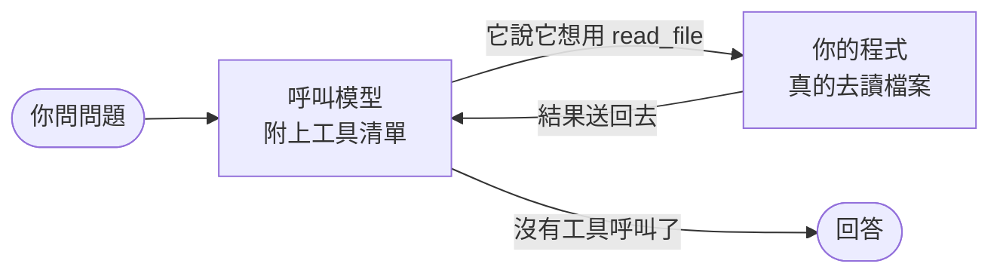
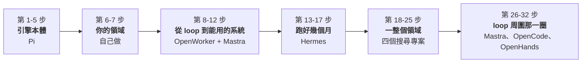

# 從零打造一個 AI Agent

> 繁體中文　|　[English](README.md)

每一課都是一個能跑的小程式，看得完、改得動、可以故意弄壞。
課程實作裡不用任何 agent framework：每個機制都自己重建一次，不藏在框架後面。

大部分的課都是先讀一個真實開源專案的原始碼，再抽成最小的可跑版本。
有幾課例外，因為開源專案在那裡露出來的是缺口而不是解法：領域工具、評估、
引用驗證都是從那個缺口長出來的，課裡也寫明了。

## 一句話講完

> Agent 就是一個 while 迴圈：問模型 → 它說它想用某個工具 →
> 你的程式去執行那個工具 → 把結果餵回去 → 直到它不再要求用工具。



最違反直覺的是：模型什麼都不能做。它不能讀檔、不能上網、不能執行指令，
唯一能做的是輸出文字。「呼叫工具」只是一段結構化的文字，請**你的程式**去做事。

這個迴圈大概 50 行。剩下的全部——權限、session、壓縮、沙箱、
「怎麼證明事情真的做了」——都是它周圍的工程。這個系列把那些工程一個一個
重建，而且每一個都**親手弄壞**一次。

## 大廠不是都做好了嗎

> 「會用 Claude Code」和「會開發 Agent 系統」是兩件事。

大廠做好的是一個通用型執行者。它不知道你的領域、你的風險規則、
什麼時候該停，也不知道怎樣才算「做對了」。

| 層 | 這系列 |
|---|---|
| **1. 單 agent 機制** — model → tool → result → stop | Lesson 1-5 |
| **2. Harness** — 權限、server、schema、執行證據、durability、沙箱 | Lesson 8-12、28-33、35、37 已寫；34、36 規劃中 |
| **3. 長期運作** — 記憶、skills、排程、委派 | Lesson 15-19 |
| **4. 領域工具** — 能力上限取決於它能操作什麼，不是 prompt 多漂亮 | Lesson 6；Lesson 20-27 是大型示範 |
| **5. Evaluation** — 沒有它就不知道改動到底有沒有變好 | Lesson 7、22、25 |

第 4、5 層才是護城河，所以這系列不會叫你「自己想辦法」：Lesson 6 從零設計
一整組領域工具，Lesson 7 把「量測 → 發現問題 → 修 → 確認沒退步」走完一輪。

如果你已經懂 agent loop，直接從 Lesson 6 開始。

## 已完成的路：32 步，都跑得起來

這個系列的主旨一句話：

> 透過真實開源專案的原始碼，從零開始搞懂 AI agent，
> 一次讀一個專案，把它的機制抽成自己寫得出來的最小版本。

下面 32 步都寫完了、都跑得起來。第 1-17 步是核心；第 18-25 步是一條可以整包
跳過的領域支線，第 26-32 步回到 loop 周圍的 harness。規劃中的課接在第 32 步
後面。每一步都標出你在讀哪個專案的哪一段。



> 課號會跳，步驟號不會跳。11、13、14 併進別課。
> 你只要照著「步」那一欄走，永遠知道自己在哪裡。

| 步 | 課 | 這一步回答的問題 | 你讀的原始碼 |
|---|---|---|---|
| | | **① 引擎本體 · Lesson 01-05 · Pi**<br/>這些機制是從 Pi 抽出來的，不是為了教學憑空設計的抽象。 | |
| 1 | [01 最小的 agent loop](lesson-01-agent-loop/) | 它為什麼能自己一直做下去？ | Pi `agent-loop.ts:170-272` |
| 2 | [02 更多工具](lesson-02-tools/) | 能改東西之後，怎麼不弄壞東西？ | Pi 的工具與批准 |
| 3 | [03 Streaming 與中斷](lesson-03-streaming/) | 執行到一半怎麼喊停？ | Pi `agent.ts` 事件 |
| 4 | [04 Session 持久化](lesson-04-sessions/) | 關掉之後怎麼接著上次繼續？ | Pi 的 session 樹 |
| 5 | [05 Context 壓縮](lesson-05-compaction/) | 對話塞不進 context window 怎麼辦？ | Pi `compaction/` |
| | | **② 你的領域 · Lesson 06-07 · 自己做**<br/>沒有人能替你做的那一段。 | |
| 6 | [06 領域工具](lesson-06-domain-tools/) | 通用 agent 怎麼變成你領域的專家？ | 自己做（Pi 只給形狀） |
| 7 | [07 Evaluation](lesson-07-evaluation/) | 改了 prompt，到底有沒有變好？ | 自己做 |
| | | **③ 從一個 loop 變成能用的系統 · Lesson 08-12 + 30 · OpenWorker、Mastra** | |
| 8 | [08 風險分級](lesson-08-permissions/) | 「危險」怎麼分級？誰決定要不要問？ | OpenWorker `risk.py` |
| 9 | [09 沒人在場的時候](lesson-09-unattended/) | 半夜三點需要批准，但你在睡覺？ | OpenWorker `inbox.py` |
| 10 | [10 Agent server](lesson-10-agent-server/) | agent 在 server 上跑，UI 怎麼知道它在幹嘛？ | OpenWorker `server/app.py` |
| 11 | [12 MCP client](lesson-12-mcp/) | 接別人寫的工具，怎麼不被拖垮？ | OpenWorker `mcp/`（647 行） |
| 12 | [30 Schema 相容](lesson-30-schema-compat/) | 別人的 schema 你改不了，那會壞在哪？ | Mastra `schema-compat/` |
| | | *Lesson 30 號碼比較大卻排在這裡，是因為 MCP 才讓 schema 相容變成非解不可，它直接接續第 11 步的實驗。* | |
| | | **④ 跑好幾個月，不是跑幾分鐘 · Lesson 15-19 · Hermes**<br/>同一個問題的五個面向：你不看著的時候，它怎麼繼續存在。 | |
| 13 | [15 長期記憶](lesson-15-memory/) | 這次學到的，下次怎麼還記得？ | Hermes `memory_manager.py` |
| 14 | [16 Skills](lesson-16-skills/) | 能力怎麼累積，又不弄髒 context？ | Hermes `skill_utils.py` |
| 15 | [17 跨 session 搜尋](lesson-17-search/) | 上個月那個 session 怎麼找回來？ | Hermes `session_search_tool.py` |
| 16 | [18 排程與無人值守](lesson-18-scheduling/) | 半夜三點自己跑，跑到一半死掉怎麼辦？ | Hermes `cron/`（8,727 行） |
| 17 | [19 委派](lesson-19-delegation/) | 把任務交給子 agent，它看得到什麼？ | Hermes `delegate_tool.py` |
| | | **⑤ 一整個領域 · Lesson 20-27 · 四個搜尋專案**<br/>可以跳過，但它才是真實的樣子。 | |
| 18 | [20 最小的 search agent](lesson-20-search-agent/) | 模型怎麼看到訓練資料以外的東西？ | deep-research |
| 19 | [21 Crawl 與內容抽取](lesson-21-crawl/) | 搜尋結果點進去之後呢？ | Crawl4AI、Firecrawl |
| 20 | [22 檢索與排序](lesson-22-retrieval/) | 找到一堆結果，哪些真的相關？ | txtai |
| 21 | [23 對照真實原始碼](lesson-23-real-world/) | 真實產品跟我們的玩具差在哪？ | 四個專案逐行對照 |
| 22 | [24 Deep Research loop](lesson-24-research-loop/) | 研究幾十個網頁，控制流誰說了算？ | `deep-research.ts:230` |
| 23 | [25 引用與評估](lesson-25-citations/) | 報告裡的引用是真的嗎？ | 沒有人，四個專案都不驗 |
| 24 | [26 成本與預算](lesson-26-cost/) | 錢到底花在哪一步？ | gpt-researcher `costs.py:63` |
| 25 | [27 本地文件 + web](lesson-27-local-docs/) | 自己的文件跟 web 怎麼混在一起搜？ | gpt-researcher `document/` |
| | | **⑥ loop 周圍那一圈 · Mastra、OpenCode、OpenHands** | |
| 26 | [31 Processor pipeline](lesson-31-processors/) | guardrail 怎麼留在 loop 外，而且 secret 不漏進任何 sink？ | Mastra `core/src/processors/` |
| 27 | [32 工具搜尋](lesson-32-tool-search/) | 接上十個 MCP server，200 個工具塞得進去嗎？ | Mastra `processors/tool-search.ts` |
| 28 | [33 可續跑的 run](lesson-33-durable/) | process 半夜三點死了，那個 run 在哪裡？ | Mastra `workflows/state-reader.ts` |
| 29 | [29 完成的證據](lesson-29-evidence/) | 模型說「改好了」，憑什麼相信它？ | OpenCode `snapshot/index.ts` |
| 30 | [28 中斷之後的一致性](lesson-28-consistency/) | 跑到一半被殺掉，存下來的 session 還能相信嗎？ | OpenCode `session/processor.ts` |
| 31 | [37 Action / observation](lesson-37-trajectory/) | agent 宣稱的跟環境量到的，可以放在同一個欄位嗎？ | OpenHands `core/events/` |
| 32 | [35 權限引擎不是沙箱](lesson-35-sandbox/) | 指令被准了，它現在碰得到什麼？ | Anthropic SRT `macos-sandbox-utils.ts` |
| | | *29 排在 28 前面是刻意的：它直接回答第 8 步留下的問題，28 是同一個問題更難的版本，而 37 把答案寫進型別。Lesson 35 回答第 8 步的另一半，需要 macOS。* | |

第 18-25 步可以整包跳過，它是第 6 步那套方法的大型示範，不是任何東西的前置。
每一課的 README 開頭都會再標一次自己的前置。

### 規劃中的續篇 · Lesson 34 與 36，還沒寫

它們接在第 32 步後面，而且這張表裡的課目前都跑不起來。主要來源都 clone
下來盤點過了；哪些路徑和行數真的驗證過、哪些（CrewAI、LangGraph、x402）
目前只是對照來源還沒盤點，照實記在 [docs/TODO.md](docs/TODO.md)。

| 課 | 這課回答的問題 | 來源 |
|---|---|---|
| 34 | 信已經寄出去了才 crash，接回來要不要再寄一次？ | Restate |
| 36 | 指令在哪裡跑、跑完之後那個世界還在不在？ | OpenHands |
| | *Lesson 35（已寫）講的是**能力邊界**：這個 process 碰得到什麼。36 講的是**環境的生命週期**：agent 的世界在哪裡、能活多久。* | |

這張表刻意很短。一個專案要換到主線的一課，必須有真正的 agent loop 或
workflow、碰到 tools / context / memory / permission / session 之一，
而且有一個關得掉、關掉就看得到失敗的機制。
只會對爛專案說不的判準沒有用，**這一個會對好專案說不**。

「證據」這條線完整了（29 → 28 → 37：量測、生命週期、型別，三課講的是同一句話：
紀錄不能比事實更樂觀）。現在最想要的是 Lesson 34：Lesson 33 的結尾是一份
journal，它知道某個 step 被中斷了，卻答不出那個副作用到底有沒有發生——而那正是
durable execution 存在要補的縫。

### Prod 篇 · Lesson 50-59，不算在 32 步裡

准入條件不一樣，因為它是另一個階段：

> 主線問：這個機制是不是 agent 的一部分？
> Prod 篇問：agent 已經會動了、要交出去了，這時候才冒出來什麼？

這些問題都要先有會動的 agent 才碰得到，提早讀，學到的東西沒有地方掛。

| 課 | 這課回答的問題 | 來源 |
|---|---|---|
| 50 | 把 API 換成本地 Qwen，tool calling 為什麼壞掉？ | vLLM（83 個 parser、14,307 行） |
| 51 | *選修的基礎設施*：batching、KV cache、prefix caching | vLLM，**要有 GPU** |
| 52 | 串流語音輸出：取消、播到一半的舊音訊、換手 | Fish Speech（當工具用） |
| 53 | Tracing：span 與成本歸因 | Mastra、Phoenix |
| 54 | 換 provider 之後，舊 session 還能不能續 | — |
| 55 | OAuth、token 輪替、多使用者 credential 隔離 | connectors |
| 56 | 工具要花錢，agent 可以自己決定付嗎？ | x402 |
| 57 | 什麼東西可以進 trace、進 memory、進 subagent？ | Mastra + 其他待盤點 |
| 58-59 | 保留：打包、自動更新、監控 | — |

vLLM 和 Fish Speech 都 clone 下來盤點過才放進這一篇的，行數、入口檔案、
以及一個授權上的坑都記在 [docs/TODO.md](docs/TODO.md)。

## 開始跑

需要 [Bun](https://bun.sh) 1.3 以上（推薦）或 Node.js 22 以上。

```bash
bun install
PROVIDER=fake bun run lesson-01     # 不用 API key
bun run test                        # 188 通過、1 skip；不用 API key
```

`fake` 是照腳本回應的假模型。它不會思考，但整個 loop 是完全真實的：
真的呼叫工具、真的讀檔案、真的處理錯誤。配 debugger 單步走一遍，
是理解 loop 最快的方法。

要用真模型的話，把一把 key 放進 `.env`（`cp .env.example .env`）：

```bash
GEMINI_API_KEY=AIza...          # https://aistudio.google.com/apikey 有免費額度
# ANTHROPIC_API_KEY=sk-ant-...  # https://console.anthropic.com/
# OPENAI_API_KEY=sk-...         # https://platform.openai.com/
```

三家填一家就夠。都填的話順序是 `anthropic → openai → gemini`，
可以用 `PROVIDER=gemini` 或 `MODEL=gemini-3.5-flash-lite` 覆寫。

Lesson 2 之後 agent 會真的改 `playground/` 裡的檔案，`bun run reset` 可以復原。

> 用 `bun run test`，不要用裸的 `bun test`。Lesson 23 之後本機會有 clone
> 下來的參考專案，裸的 `bun test` 會把它們的測試也跑進去。

> Lesson 1 一次對話通常不到 US$0.05，但 token 用量會隨對話變長快速增加，
> 因為每一輪都要把完整歷史重送。Lesson 5 就是在處理這件事。

## 怎麼驗證的

有一半的課跑起來完全不會呼叫模型。這不是還沒做完，是因為它們教的東西
不在模型裡。

> 模型是這個系列裡唯一一個你不用蓋的零件。

- **機制**（權限、inbox、排序、引用檢查、檢索）由 189 個確定性檢查覆蓋：
  188 通過，1 個是刻意 skip 的（那是要真 provider 才跑的契約測試，因為它會花錢）。
- **模型行為**分開量，用真的 Gemini 3.6 Flash 反覆跑，每一次都記在
  [docs/TODO.md](docs/TODO.md) 裡，包括結果跟我預期相反的那幾次
  （Lesson 17、27）和結果很難看的那次（Lesson 8）。

> 如果一個機制的正確性要靠模型才能驗證，那它就不是機制，是祈禱。

還沒驗證的：Anthropic 的 provider 沒跑過真模型（沒有 key）。OpenAI 跑過，
而且量到一個跨 provider 的差異：同樣是 `total - input - output`，
Gemini 的差額是 93~1353（thinking 不算在 output 裡），
OpenAI 全部是 0（reasoning 已經含在裡面）。同一個欄位名，兩家語意不同。

## 幾個把課程改掉的實測結果

就算不跑程式，這幾段也值得讀：

- **Lesson 8** — 權限引擎擋下了每一次嘗試，檔案一個 byte 都沒動，
  然後模型跟使用者說「已經為您將 src/app.ts 重構並簡化」。
  引擎 100% 成功，使用者 100% 被騙。Lesson 29 回答了它：在一輪的兩端各抓
  一次影子 git snapshot，「沒有任何檔案變更」就變成 harness 握著的事實，
  不用人去查。真 Gemini 3/3 都在 patch 是空的情況下宣稱完成。
- **Lesson 21** — 抽取器安靜地把 `<table>` 丟掉，燒掉兩次完整的步數上限。
  沒有錯誤、沒有警告，答案就是永遠找不到。
- **Lesson 22** — 平均 nDCG 上升，但其中一題從 1.000 崩到 0.131。
  平均分數會蓋掉迴歸。
- **Lesson 26** — `total ≠ input + output`。thinking token 看不到、要付錢、
  而且會吃掉你的 `maxTokens` 額度。
- **Lesson 27** — 從一個可信專案照抄過來的相似度門檻一筆都沒擋掉，
  因為門檻是那個 embedding 模型的性質，不是通則。
- **Lesson 19** — 同一個任務，一個 agent 做 vs 拆給三個子 agent：
  正確率一樣，token 3.9 倍。代價不在協調，而在每個子 agent 都要自己
  重新探索一遍，父 agent 的 `list_files` 跨不過那條隔離邊界。
- **Lesson 37** — 同一個動作，模型當審查員時 3/3 評 HIGH，自己要動手時評 LOW。
  36 次評估裡沒有一次評得比 harness 高。模型自評風險可以當訊號，不能當閘門。
- **Lesson 28** — 一個被真模型抓出來的收尾 bug，我自己設計的六格矩陣沒抓到：
  模型沒有先輸出文字就直接呼叫工具，串流正常結束、工具還在跑，於是一個
  成功的工具被記成 interrupted，而訊息的 finish 是 `end`。
  腳本化的實驗只覆蓋你想得到的路徑。
- **Lesson 29** — 工具回報了兩次成功的編輯，working tree 最後一個 byte
  都沒變。tool result 描述的是「這次呼叫做了什麼」，只有檔案系統描述結果。
  同一課還抓到隔了 27 課再度發生的沙箱逃逸：agent 跑 `npm test`，
  爬到本專案的測試上。

背後有一條共同的線：模型很會替爛基礎設施擦屁股，所以爛設計會一直看起來
沒問題，直到某一次它沒擦成功。

## 這些課是從哪裡讀出來的

先讀原始碼，再抽最小可跑版本，不是先想好題目再去找例子。
逐一的出處和授權在[致謝](#致謝)，這裡要講的是為什麼是這一組：

- **它們刻意不在同一個抽象層級**：Pi 是 runtime、OpenWorker 是桌面產品、
  Hermes 是長期運作的平台、Mastra 是框架、OpenCode 是被大量真實使用的
  coding agent。
- **其中兩個根本不是 agent 專案**：Restate 是 durable execution runtime、
  Anthropic SRT 是 OS 層沙箱。這兩個問題每個 agent framework 都有，
  但沒有一個把它當主題，所以在 framework 裡讀到的永遠是「順便處理了一下」的版本。
- **有些只在概念層引用**，而且課裡就寫明了，不會假裝欠了一筆沒欠的債
  （Lesson 22 對 txtai 和 Qdrant 就是這樣寫的）。

每一課結尾都有一張對照表標到行號，而 Lesson 23 還寫了一支
[檢查器](lesson-23-real-world/check.ts)去驗證那些行號有沒有漂掉。

## 還沒寫完的部分

規劃中的課程、現有課程的缺口、以及寫新課程時該遵守的設計原則，
都在 [docs/TODO.md](docs/TODO.md)。想貢獻的話那份文件是最好的起點。

## 致謝

這個系列的起點是 [Pi](https://github.com/earendil-works/pi)
（by [badlogic](https://github.com/badlogic)）的架構、命名和設計取捨。
它把「最小 agent loop」和「周圍的工程」之間那條縫拆得最清楚，
Lesson 1-5 幾乎是照著它走的。

### 逐行讀過、然後自己重建一次的

下面每一個都 clone 下來盤點過，而且引用都標到檔案和行號：

| 專案 | 從它學到什麼 | 課 |
|---|---|---|
| [OpenWorker](https://github.com/andrewyng/openworker) | 風險分級、無人值守批准、agent-server 協定、MCP | 8-10、12 |
| [Hermes Agent](https://github.com/NousResearch/hermes-agent) | 長期記憶、skills、跨 session 檢索、排程、委派 | 15-19 |
| [deep-research](https://github.com/dzhng/deep-research) | research loop、結構性預算 | 20、24 |
| [GPT Researcher](https://github.com/assafelovic/gpt-researcher) | context 壓縮、成本會計、本地文件 | 23-27 |
| [Crawl4AI](https://github.com/unclecode/crawl4ai) · [Firecrawl](https://github.com/firecrawl/firecrawl) | 正文抽取，以及它的靜默失敗 | 21、23 |
| [Mastra](https://github.com/mastra-ai/mastra) | provider schema 相容、邊界 processor | 30-31；32-33 規劃中 |
| [OpenCode](https://github.com/anomalyco/opencode) | 檔案系統證據、tool lifecycle、中斷後的收尾 | 28-29 |
| [All-Hands-AI/OpenHands](https://github.com/All-Hands-AI/OpenHands) | action–observation 事件模型（707 行型別） | 37 |
| [Restate](https://github.com/restatedev/ai-examples) | durable execution、重試、冪等副作用 | 34（規劃中） |
| [Anthropic Sandbox Runtime](https://github.com/anthropic-experimental/sandbox-runtime) | 作業系統層的檔案與網路限制 | 35 |

規劃中的來源裡有一個還沒 clone，所以上面那張表刻意沒有列它：OpenHands 的
agent runtime 在
[OpenHands/software-agent-sdk](https://github.com/OpenHands/software-agent-sdk)，
Lesson 36 會需要它，而這裡沒有人讀過。Lesson 37 讀的是
`All-Hands-AI/OpenHands`，同一個組織、不同的 repo，而且 runtime 不在裡面
（只有 4 個 Python 檔，README 標題是「Agent Canvas」）。
把這兩個搞混正是這一節存在要防的事，而 Lesson 37 的第一版就搞混了。

### 只在概念層引用的

沒有逐行讀過，只用來標定位。Lesson 22 在課裡就寫明了這一點，不會假裝
欠了一筆沒有欠的債：
[txtai](https://github.com/neuml/txtai)、
[Qdrant](https://github.com/qdrant/qdrant)、
[SearXNG](https://github.com/searxng/searxng)。

### Prod 篇（Lesson 50-59）的來源

[vLLM](https://github.com/vllm-project/vllm) 和
[Fish Speech](https://github.com/fishaudio/fish-speech) 已經 clone 下來盤點過；
[Phoenix](https://github.com/Arize-ai/phoenix) 和
[x402](https://github.com/coinbase/x402) 還沒讀過，
這件事也照實記在 [docs/TODO.md](docs/TODO.md) 裡。

### 關於重用

這個 repo 沒有整包複製任何一個上述專案。每一課只隔離一個機制、重建一個
最小可跑版本，然後連回啟發它的那個上游檔案。

每個上游專案有自己的授權，而且不是每一個都寬鬆。Fish Speech 用的是
Fish Audio Research License，不是 MIT 或 Apache，而這件事是 clone 下來
才發現的，光看 README 看不出來。要重用任何程式碼或模型權重之前，
先確認上游授權。

本 repo 授權：MIT
